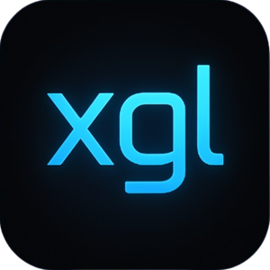

# xitali Game Launcher

Nowoczesny launcher gier dla systemu Windows, pozwalający zarządzać biblioteką gier z różnych platform (Steam, Epic Games, Xbox, GOG, Origin, Battle.net, Ubisoft Connect i inne).



## Najnowsza wersja

**Wersja 1.0.2** (11.07.2024) - Naprawiono funkcjonalność zapamiętywania pozycji okna oraz uruchamiania przy starcie systemu. Szczegóły w [CHANGELOG.md](CHANGELOG.md).

## Funkcje

- **Jednolita biblioteka gier:** Zarządzaj wszystkimi grami z jednego miejsca
- **Wieloplatformowość:** Automatyczne wykrywanie gier z popularnych platform:
  - Steam
  - Epic Games
  - Xbox/Microsoft Store
  - GOG Galaxy
  - Origin/EA
  - Battle.net
  - Ubisoft Connect
- **Automatyczny scraping:** Pobieranie okładek gier i ikon platform z SteamGridDB
- **Nowoczesny UI/UX:** 
  - Zwijany/rozwijany pasek boczny
  - Adaptacyjny układ siatki gier
  - Animacje i efekty wizualne
  - Tryb ciemny
- **Szybkie uruchamianie:** Uruchamiaj gry bezpośrednio bez konieczności otwierania launcherów
- **Konfigurowalność:** Dostosuj ustawienia zgodnie z własnymi preferencjami

## Zrzuty ekranu

### Główny widok


### Ustawienia


## Technologie

- **[Electron](https://www.electronjs.org/)** - Framework do tworzenia aplikacji desktopowych
- **[React](https://reactjs.org/)** - Biblioteka JavaScript do budowania interfejsów użytkownika
- **[Tailwind CSS](https://tailwindcss.com/)** - Framework CSS utility-first
- **[Vite](https://vitejs.dev/)** - Narzędzie do szybkiego budowania
- **[Cheerio](https://cheerio.js.org/)** - Lekka implementacja jQuery dla Node.js do parsowania HTML

## Wymagania systemowe

- Windows 10 lub nowszy
- Minimum 4 GB RAM
- 200 MB wolnego miejsca na dysku
- Zainstalowane platformy gier, które chcesz zintegrować

## Instalacja i uruchomienie

### Dla użytkowników

1. Pobierz najnowszą wersję instalatora z [sekcji Releases](https://github.com/xitali/xitaliGL/releases)
2. Uruchom pobrany plik instalacyjny i postępuj zgodnie z instrukcjami
3. Po instalacji uruchom "xitali Game Launcher" z pulpitu lub menu Start

### Dla deweloperów

#### Instalacja zależności
```bash
# Sklonuj repozytorium
git clone https://github.com/xitali/xitaliGL.git
cd xitaliGL

# Zainstaluj zależności
npm install
```

#### Uruchomienie w trybie deweloperskim
```bash
npm run electron:dev
```

#### Zbudowanie aplikacji
```bash
npm run electron:build
```

#### Publikowanie nowej wersji
```bash
npm run publish
```

## Struktura projektu

```
/xitali-game-launcher/
├── assets/                # Zasoby statyczne
│   ├── icons/             # Ikony aplikacji i platform
│   ├── covers/            # Pobrane okładki gier (gitignore)
│   └── screenshots/       # Zrzuty ekranu do README
├── components/            # Komponenty React
│   ├── GameGrid.jsx       # Siatka gier
│   ├── Settings.jsx       # Panel ustawień
│   └── Sidebar.jsx        # Pasek boczny
├── services/              # Serwisy i logika biznesowa
│   ├── coverService.js    # Pobieranie okładek i ikon
│   └── gameService.js     # Wykrywanie gier i zarządzanie
├── dist/                  # Skompilowane pliki (gitignore)
├── node_modules/          # Zależności (gitignore)
├── index.html             # Główny plik HTML
├── main.js                # Proces główny Electron
├── preload.js             # Skrypt preload Electron
├── package.json           # Konfiguracja projektu
├── styles.css             # Główne style CSS
├── README.md              # Dokumentacja
└── .gitignore             # Wzorce plików do zignorowania
```

## Integracja z SteamGridDB

Aplikacja automatycznie pobiera:
- Okładki gier ze strony SteamGridDB
- Ikony platform ze strony SteamGridDB

Pobrane zasoby są przechowywane lokalnie w folderach `assets/covers` i `assets/icons`.

## Rozwiązywanie problemów

### Nie wykrywa niektórych gier
- Upewnij się, że ścieżki platform są poprawnie skonfigurowane w Ustawieniach
- Spróbuj uruchomić launcher z uprawnieniami administratora
- Wyczyść pamięć podręczną gier w Ustawieniach i ponownie uruchom aplikację

### Problemy z uruchamianiem gier
- Upewnij się, że odpowiednie platformy są zainstalowane i działają
- Sprawdź, czy ścieżki do gier są prawidłowe
- Niektóre gry wymagają uruchomienia poprzez swój natywny launcher

## Licencja

Projekt jest dostępny na licencji [MIT](LICENSE).

## Autor

Emanuel 'xitali' Włoch 
